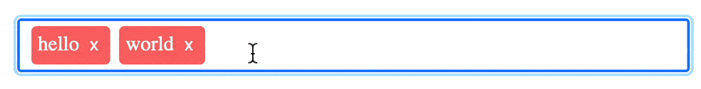

# TagInput

A versatile tag input component built with Vue 3 Composition API.

[](https://www.npmjs.com/package/@mayank1513/vue-tag-input) [](https://codecov.io/gh/mayank1513/tag-input) [](https://www.npmjs.com/package/@mayank1513/vue-tag-input) [](https://www.npmjs.com/package/@mayank1513/vue-tag-input) [](https://github.com/mayank1513/tag-input/actions/workflows/publish-to-npm-on-new-release.yml) [](https://www.codementor.io/@mayank1513?refer=badge)



## Features

- ✅ No dependencies
- ✅ Input box stays focused - no need to re-focus the input => better UX
- ✅ Autocompletion
- ✅ Use arrow keys to navigate and enter key to select autocomplete options
- ✅ Fast setup
- ✅ Customize tag validator
- ✅ Works with Vuex
- ✅ Small size: 1.6 kB gzipped
- ✅ Many customization options
- ✅ Delete tags on backspace / delete key
- ✅ Confirm before delete - tags turns red when backspace is pressed, gets deleted when backspace is pressed again
- ✅ Works well with copy & paste
- ✅ Excellent UX and accessibility
- ✅ Examples & Docs

Please read [this article](https://mayank1513.medium.com/creating-a-tag-input-component-using-the-vue-3-composition-api-feae06d58492) to learn how to build this package step by step and the background story.

To learn vue js please check out our courses [Vue.js Complete Course + Guide](https://www.udemy.com/course/vuejs-complete-course-plus-guide/?referralCode=93BDA4A1FE3F73C37CD2) and [Vue 3 Essentials](https://www.udemy.com/course/vue-3-essentials/?referralCode=E6D2FDE2B8B06C1991F1)

Follow us on [FaceBook](https://www.facebook.com/Learn-Vue-Js-104953725168718/) to get the latest discount coupons and update to our articles and packages.

> To keep it thin and performant we have chosen to provide only the minified version. Because, that's what you really need. In case you are looking for the full version build your own from this source code as per [Build](#Build) section.

## [live demo](https://vue-tag-input.vercel.app)

## Install

### NPM

```bash
npm i @mayank1513/vue-tag-input --production
```

or

```bash
pnpm i @mayank1513/vue-tag-input --production
```

or

```bash
yarn add @mayank1513/vue-tag-input --production
```

### CDN

```
<script src="https://unpkg.com/vue@3/dist/vue.global.js"></script>
<script src="https://unpkg.com/@mayank1513/vue-tag-input"></script>
<link rel="stylesheet" href="https://unpkg.com/@mayank1513/vue-tag-input@1.0.0/dist/style.css">
```

## Usage

### npm

```vue
<template>
  ...
  <tag-input v-model="tags" />
  ...
</template>

<script>
import TagInput from '@mayank1513/vue-tag-input'
import '@mayank1513/vue-tag-input/style.css'
...

export default {
  name: 'App',
  data() {
    return {
      tags: [],
      ...
    };
  },
  components: {
    TagInput,
    ...
  },
  ...
}
</script>
```

### cdn

basic usage

```html
<!DOCTYPE html>
<html lang="en">
  <head>
    <meta charset="UTF-8" />
    <meta http-equiv="X-UA-Compatible" content="IE=edge" />
    <meta name="viewport" content="width=device-width, initial-scale=1.0" />
    <title>Vue Tag Input Demo</title>
    <script src="https://unpkg.com/vue@3/dist/vue.global.js"></script>
    <script src="https://unpkg.com/@mayank1513/vue-tag-input"></script>
    <link
      rel="stylesheet"
      href="https://unpkg.com/@mayank1513/vue-tag-input@1.0.0/style.css"
    />
  </head>

  <body>
    <div id="app">
      <tag-input></tag-input>
    </div>
  </body>
  <script>
    Vue.createApp({
      components: {
        TagInput,
      },
    }).mount("#app");
  </script>
</html>
```

#### advanced usage

```html
<!DOCTYPE html>
<html lang="en">
  <head>
    <meta charset="UTF-8" />
    <meta http-equiv="X-UA-Compatible" content="IE=edge" />
    <meta name="viewport" content="width=device-width, initial-scale=1.0" />
    <title>Document</title>
    <script src="https://unpkg.com/vue@3/dist/vue.global.js"></script>
    <script src="https://unpkg.com/@mayank1513/vue-tag-input"></script>
    <link
      rel="stylesheet"
      href="https://unpkg.com/@mayank1513/vue-tag-input@1.0.0/style.css"
    />
    <style>
      #app {
        font-family: Avenir, Helvetica, Arial, sans-serif;
        -webkit-font-smoothing: antialiased;
        -moz-osx-font-smoothing: grayscale;
        text-align: center;
        color: #2c3e50;
        margin-top: 60px;
        max-width: 1400px;
        margin: auto;
      }

      .main {
        text-align: start;
      }
    </style>
  </head>

  <body>
    <div id="app">
      
      <br />
      <h2>Presents</h2>
      <h1>Vue Tag Input</h1>
      <hr />
      <div class="main">
        <h1>Default options</h1>
        <tag-input v-model="tags" />
        <br />
        <span
          >Use <code>enter</code> key or <code>tab</code> key to create a new
          tag.</span
        >
        <h1>With custom delimiter and colors</h1>
        <tag-input
          tagBgColor="lightgreen"
          tagTextColor="darkgreen"
          :customDelimiter="customDelimiter"
          v-model="tags"
        />
        <br />
        <span
          >Use <code>enter</code> key or <code>tab</code> key or any of the
          custom delimeters to create a new tag.</span
        >
        <p>
          Custom delimiters:
          <code v-for="delim in customDelimiter" :key="delim">
            "{{delim}}"</code
          >
        </p>
        <br />
        <h1>Do not allow custom tags</h1>
        <tag-input
          :options="options"
          :allowCustom="false"
          tagBgColor="blue"
          tagTextColor="lightblue"
          :customDelimiter="customDelimiter"
          v-model="tags"
        />
        <br />
        Try entering tag that is not in options and hit <code>enter</code>
        <br />
        <span
          >Use <code>enter</code> key or <code>tab</code> key or any of the
          custom delimeters to create a new tag.</span
        >
        <p>
          Allowed Tags:
          <code v-for="tag in options" :key="tag"> "{{tag}}"</code>
        </p>
        <p>
          Custom delimiters:
          <code v-for="delim in customDelimiter" :key="delim">
            "{{delim}}"</code
          >
        </p>
        <br />
        <h1>Provide options for autofill but also allow custom tags</h1>
        <tag-input
          :options="options"
          tagBgColor="blue"
          tagTextColor="lightblue"
          :customDelimiter="customDelimiter"
          v-model="tags"
        />
        <br />
        <span
          >Use <code>enter</code> key or <code>tab</code> key or any of the
          custom delimeters to create a new tag.</span
        >
        <p>
          Allowed Tags:
          <code v-for="tag in options" :key="tag"> "{{tag}}"</code>
        </p>
        <p>
          Custom delimiters:
          <code v-for="delim in customDelimiter" :key="delim">
            "{{delim}}"</code
          >
        </p>
        <br />
      </div>
    </div>

    <script>
      Vue.createApp({
        data() {
          return {
            tags: [],
            customDelimiter: [",", " "],
            options: ["vue", "composition", "js", "mytag1", "mayank1513"],
          };
        },
        components: {
          TagInput,
        },
      }).mount("#app");
    </script>
  </body>
</html>
```

## Build

To build the example clone the repo `git clone https://github.com/mayank1513/tag-input.git` and run

```
npm i && npm run build
// or
pnpm i && npm run build
```

## Contribute

### Todo

- Update docs

## Help us to help you more

- Please start this repo
- Follow us on [FaceBook](https://www.facebook.com/Learn-Vue-Js-104953725168718/)
- Upvote our helpful posts on [StackOverflow](https://stackoverflow.com/users/9640177/mayank-kumar-chaudhari)
- Refer our courses to your colleagues, friends and business leaders
  - [Vue.js Complete Course + Guide](https://www.udemy.com/course/vuejs-complete-course-plus-guide/?referralCode=93BDA4A1FE3F73C37CD2)
  - [Vue 3 Essentials](https://www.udemy.com/course/vue-3-essentials/?referralCode=E6D2FDE2B8B06C1991F1)
- Use our referrals to get advantage of special offers
  - Open your free demat account with [Groww](https://groww.app.link/refe/mayank-kumar8914309)
  - Open your demat account with leading discount broker [Zerodha](https://zerodha.com/?c=GG0215&s=CONSOLE)
  - Buy what you need on [amzon.in](https://www.amazon.in/ref=assoc_aax_fallback_300x250?tag=mayank1513-21&linkCode=ur8) using [our refferal](https://www.amazon.in/ref=assoc_aax_fallback_300x250?tag=mayank1513-21&linkCode=ur8)
  - Buy what you need on [amazon.com](https://amzn.to/3i2PPsE)
  - Donate for social cause. We are happy if you help anyone in need. It need not be only us!
- Want to learn business skills? Checkout [Bada Business](https://www.badabusiness.com/dd/BIMK003866)

## Contribute for a Cause

- [PM Cares Fund](https://www.pmcares.gov.in/en/)
- [#IamOxygenMan](https://www.badabusiness.com/IamOxygenMan)


## License

Licensed as MIT open source. Copyright © 2023 <a href="https://mayank-chaudhari.vercel.app" target="_blank">Mayank Kumar Chaudhari</a>

<hr />

<p align="center" style="text-align:center">with 💖 by <a href="https://mayank-chaudhari.vercel.app" target="_blank">Mayank Kumar Chaudhari</a></p>
